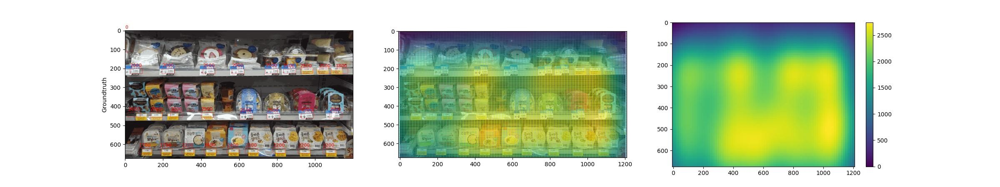
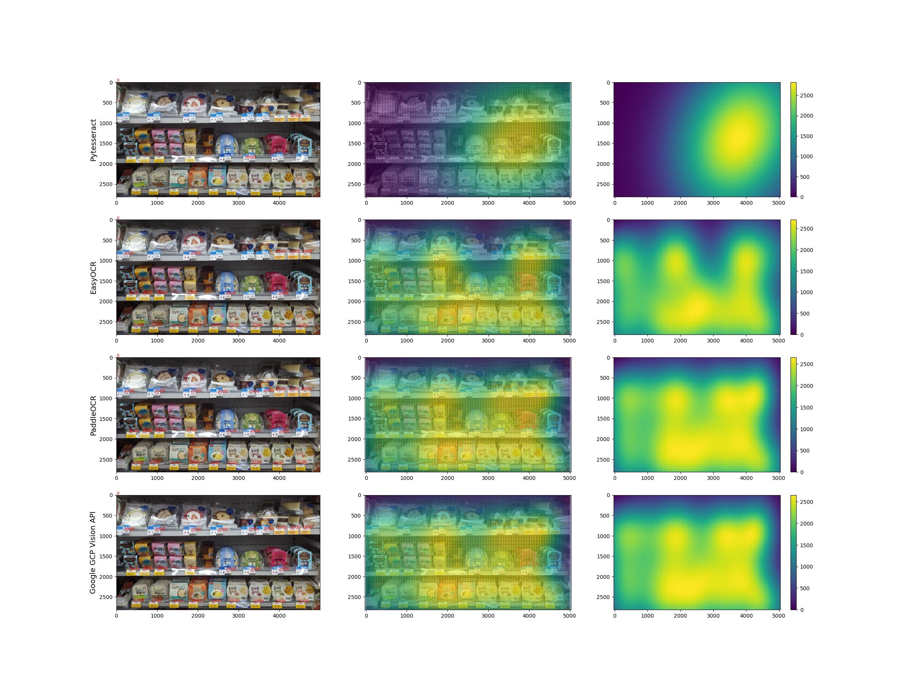

## 가격분포 (Price Distribution)
매장 진열대의 사진을 찍고 가격을 인식 후 히트맵으로 구현.
디스플레이 진열 방법에 대한 평가 보조용도.
 - ex) 매출 핵심 상품을 고객의 시선(눈높이)에 위치했는가?
 - ex) 비인기/저가 상품을 외곽 또는 바닥에 두었는가?
 - ex) 진열된 상품들의 가격은 3종 이상인가? (good, better, best)
 

### 결과 예시

  

## 사용 전에...
"UPPER_LIMIT"(ex. UPPER_LIMIT = 2500) 을 각자의 이미지에 있는 최댓값으로 변경할 것.
  

"PyTesseract"
 - https://pypi.org/project/pytesseract/
 - Tesseract installer for Windows: https://github.com/UB-Mannheim/tesseract/wiki
 - (Window) Change the directory below
 - pytesseract.pytesseract.tesseract_cmd = 'C:/Program Files/Tesseract-OCR/tesseract.exe'
 - pip install pytesseract
 - pip install tesseract
  

"EasyOCR"
 - https://github.com/JaidedAI/EasyOCR/blob/master/README.md
 - https://www.jaided.ai/easyocr/documentation/
 - pip install easyocr
 - pip install git+git://github.com/jaidedai/easyocr.git
  

"PaddleOCR"
 - https://github.com/PaddlePaddle/PaddleOCR
 - https://github.com/PaddlePaddle/Paddle
 - pip install paddlepaddle shapely pyclipper scikit-image imgaug lmdb tqdm
  

"Google GCP Vision API"
 - https://cloud.google.com/vision/docs/before-you-begin
 - pip install --upgrade google-cloud google-cloud-vision
 - JSON key required. (Not provided)
 - Exception: Image too large. Please limit to 75 megapixels.
  
